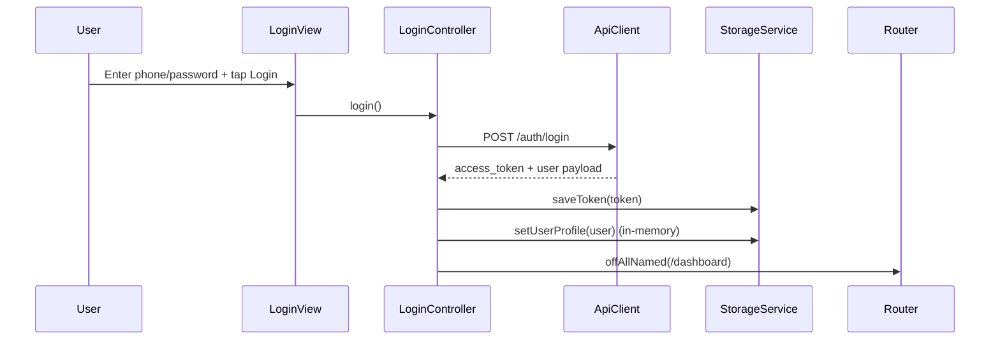
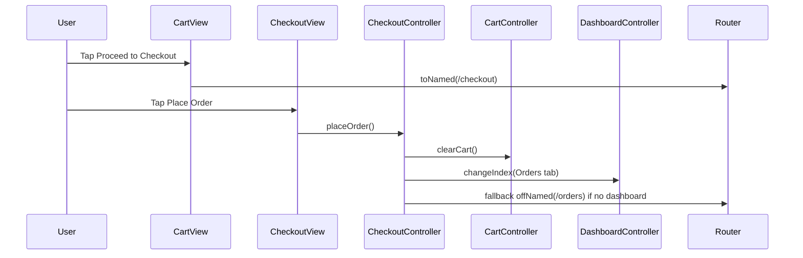
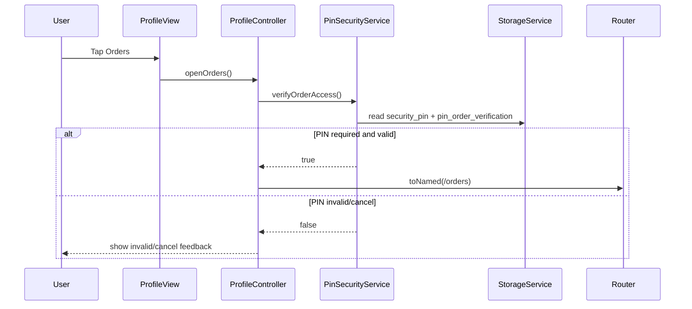

# FreshLeaf App Documentation

## 1) What this app is
FreshLeaf is a Flutter + GetX grocery app focused on organic products, with:
- Authentication (login/register)
- Product browsing and product detail
- Cart and checkout
- Orders and order detail
- Profile management (personal/security/addresses)
- AI assistant chat

The project uses **modular GetX structure** (`bindings`, `controllers`, `views`, `widgets`) for each feature.

---

## 2) Tech stack and architecture

### Core stack
- Flutter
- GetX (`get`) for routing, DI, and state management
- Dio for HTTP API calls
- GetStorage for local persistence
- Flutter Map + OpenStreetMap for map/address picking
- Geolocator + permission_handler for location permissions
- Static analysis: **very_good_analysis** (follow its lints for any new code)

### App structure
- `lib/app/modules/*` → feature modules
- `lib/app/routes/*` → named routes and route registration
- `lib/core/services/*` → API, storage, permission, security helpers
- `lib/core/models/*` → shared app models
- `lib/core/theme/*` → color/size/style system

---

## 3) Main modules and responsibilities

### Auth
- `login`, `register`
- Handles token save/clear via `StorageService`

### Dashboard
- Bottom navigation host (Home, Cart, AI Assistant, Orders, Profile)
- Keeps each tab controller initialized via `DashboardBinding`

### Home
- Hero section, categories, product highlights
- Product click navigates to Product Detail
- All network images have loading/error fallback

### Product
- `product_list` and `product_detail`
- Product detail supports quantity and add-to-cart style UI

### Cart & Checkout
- Modern cart UI with quantity controls and summary
- Dedicated `checkout` module:
  - address section
  - payment method selection
  - item summary + note
  - place order flow

### Orders
- Filtered grouped orders list
- Dedicated order detail module

### Profile
- Profile main screen
- Personal details
- Security settings
- Addresses with map search/select/save
- PIN security settings screen

### AI Assistant
- Gemini streaming chat UI
- Persisted chat history
- Highlighted important text and numeric values

---

## 4) Security and access control

### Token
- Stored in `StorageService` as `access_token`
- Used by API client for authenticated requests

### PIN Security (new)
- Source of truth for PIN state is `set_pin` in `UserProfile` (`/users/profile`)
- PIN flow:
  - If `set_pin == false`: user must verify password before setting first PIN
  - If `set_pin == true`: user updates PIN using current PIN (no password step)
  - Forgot PIN reset still uses password verification
- API errors are shown with `Get.snackbar` (no rethrow to UI layer)
- `PinSecurityService.verifyOrderAccess()` enforces PIN before protected order access

---

## 5) Address and location flow

In `profile_addresses`:
- OpenStreetMap tiles rendered by `flutter_map`
- Search via Nominatim API
- Tap map to select point
- Reverse geocode selected point to readable address
- “Current location” floating map button (Google Maps style)
- Saved addresses preview in bottom sheet

---

## 6) Routing summary

Routes are defined in:
- `lib/app/routes/app_routes.dart`
- `lib/app/routes/app_pages.dart`

Notable routes:
- `/dashboard`
- `/cart`
- `/checkout`
- `/orders`
- `/order_detail`
- `/profile`
- `/personal_details`
- `/security_settings`
- `/pin_security`
- `/addresses`
- `/ai_assistant`

---

## 7) Data persistence summary

Managed by `StorageService` (`GetStorage`):
- `access_token`
- `onboarding_seen`
- `pin_order_verification`

Also:
- AI chat history is persisted by `AiChatStorageService`
- User profile is kept in-memory (not persisted on disk), including `set_pin`

---

## 8) Image reliability policy

All `Image.network(...)` usage now includes fallback behavior:
- loading placeholder
- error placeholder icon/background

This prevents broken UI when remote image URLs fail.

---

## 9) Environment and config

Current environment setup is `dart-define` based (JSON define file), not `flutter_dotenv`.
- Example launch config uses `--dart-define-from-file=.env.local.json`
- Khmer font bundled: **Noto Sans Khmer** (`assets/fonts/noto_sans_khmer`) and used as `fontFamilyFallback` for Khmer locale.
- Theme colors are centralized in `AppColors` (light + dark, including chip/scrim/shadow).
- Splash screen added with branded logo (`assets/logo/fresh_leaf.png`) and gradient background; launch route is resolved via `LaunchRouteService` + `ProfileSyncMiddleware`.

---

## 10) How to explain this app quickly to others

Use this short pitch:
> “FreshLeaf is a modular Flutter/GetX organic grocery app with full customer flow: auth, product browse/detail, cart, checkout, orders, profile, map-based addresses, AI assistant, and optional PIN-protected order access. It uses clean feature modules, centralized services, and resilient UI patterns like image fallbacks and persistent local state.”

---

## 11) Auth UI consistency (latest)

- `login` and `register` now share consistent text field styling:
  - filled surface background
  - rounded outline border
  - themed focus/border colors
  - Cambodia prefix-first phone input (`+855`)
- `register` screen behavior:
  - non-scroll layout by default
  - scroll only when keyboard is open
  - image remains visible while keyboard is open
- `login` system navigation bar color now follows the form container surface color

---

## 12) Flow sequence diagrams

### A) Login -> Dashboard

### B) Cart -> Checkout -> Orders

### C) Profile Orders with PIN protection

---

## 13) Recent updates (March 2026)
- Added `ProfileSyncMiddleware` to refresh `/users/profile` once per session after auth.
- Replaced manual timer debounce in address search with GetX `debounce` worker.
- Centralized dark chip/input/switch colors in `AppColors`.
- Integrated Noto Sans Khmer across themes for Khmer UI rendering.
- Added modern splash screen route using the new branded logo.

---

## 14) Widget structure rule (for all contributors/agents)

- **No private nested widgets inside view files.** Every composable UI piece should live in its own file under the module’s `widgets/` folder.
- **Barrel export per module.** Create a single `widgets_<module>.dart` (or `<module>_widgets.dart`) that exports all widgets in that folder. Views import only the barrel, not individual widgets.
- **Preferred import style inside a module:** use relative paths (`../widgets/...`) instead of package imports to keep refactors cheap and avoid long package prefixes.
- **Pattern to follow:**
  1. Move `_SomeSection` / `_Card` / `_Item` classes out of the view into `widgets/some_section_widget.dart`.
  2. Add to the module barrel file.
  3. Update the view to import only the barrel.
- **Exception:** Tiny constants or `typedef`s can stay in the view; anything with `build()` should be extracted.
